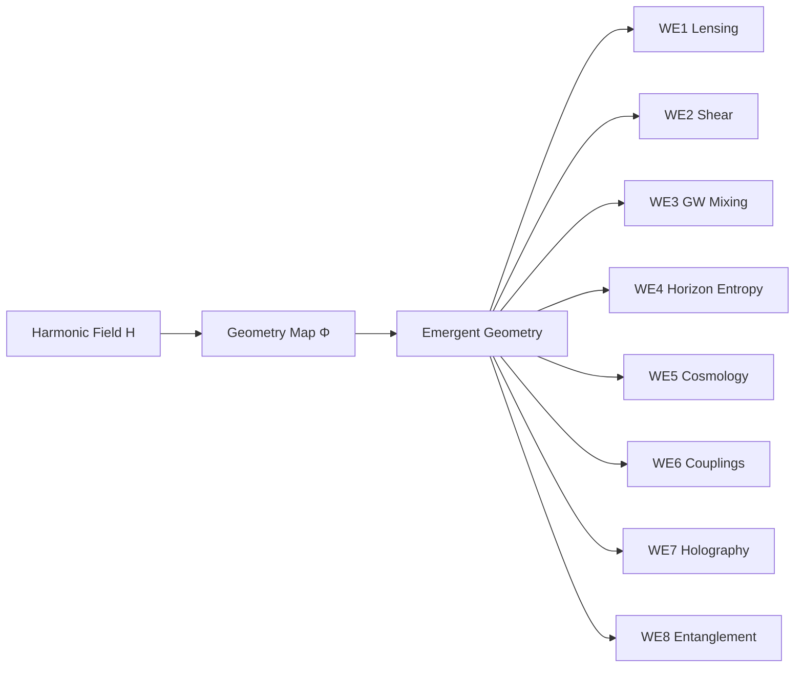

# 🗺️ Framework Map

This map summarizes the flow of the EUT program:

1. Start from the harmonic field **H**.
2. Apply the geometry map **Φ** to obtain an emergent geometric description.
3. Use that geometry to define and test the eight working elements (WE1–WE8).

## Practical interpretation

- **Harmonic layer**: defines coherence structure and resonant dynamics.
- **Geometric layer**: provides an effective metric/connection language for comparison with known physics.
- **Working elements**: package theory-to-observation links into tractable research modules.
